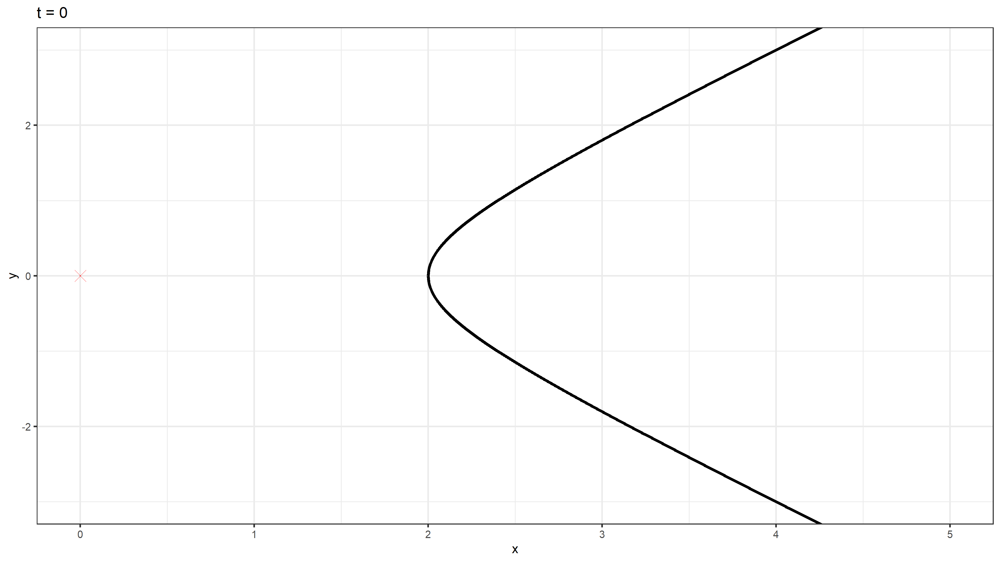
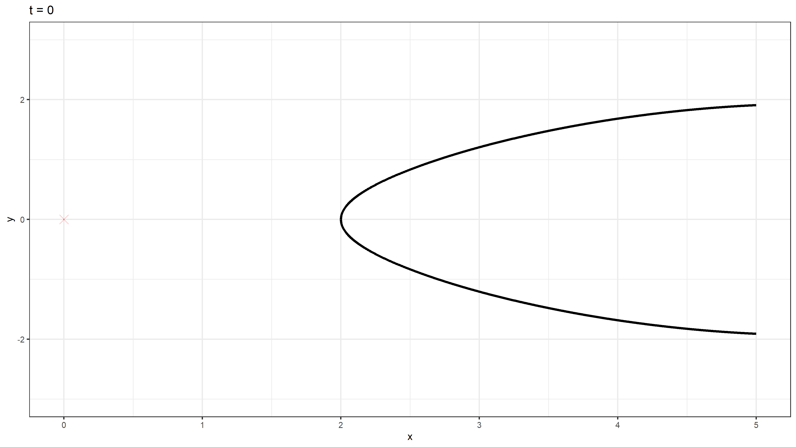

```{r setup, include=FALSE}
knitr::opts_chunk$set(echo = TRUE, fig.width = 12, dpi = 300)
```

## Bevezető gondolatok

Ez a repozitórium a 'Ferenci Tamás - Hétköznapi matematika: akusztikus lencsék tervezése atomfegyver-építéshez' videóhoz tartozó illusztrációk teljes forráskódját tartalmazza.

## A programkód

### Kiszámított robbanóanyag-profilok

Első lépésben definiálunk pár változót, csak az illusztratív példa kedvéért. Beállítjuk a kétféle robbanóanyag detonációsebességét (ebből kiszámoljuk a törésmutatót), a lencse távolságát a robbanóanyag gyújtási pontjától, valamint -- a lökéshullámot koncentráló esetben -- a fókuszálás középpontját, tehát a plutónium-mag távolságát a gyújtási ponttól:

```{r}
v1 <- 3
v2 <- 2
mu <- v1/v2
P <- 2
A <- 7
```

Definiáljuk a -- videóban látott módszerekkel -- kiszámolt profilokat, vagyis, hogy a lassú robbanóanyagnak hol kell lennie. A koncentráló esetben nem analitikus megoldást használunk, hanem egyszerűen numerikusan keressük meg a megoldást:

```{r}
hyperbola <- Vectorize(function(x, P, mu) if(x<P) NA else sqrt((mu^2-1)*x^2+2*P*mu*(1-mu)*x+(P*(mu-1))^2),
                       "x")

descartesovalis <- Vectorize(function(x, P, A, mu)
  if(x<P|x>A+1) NA else uniroot(function(y, x, P, A, mu) (sqrt(x^2+y^2)-P)/mu-A+P+sqrt(y^2+(A-x)^2),
                                c(0, 5), x, P, A, mu)$root, "x")
```

Ezek alapján kirajzolhatjuk a fenti numerikus értékekre érvényes megoldást (fekete a síkhullám, kék a koncentráló eset):

```{r}
x <- seq(0, 8, 0.01)

plot(x, hyperbola(x, 2, 1.5), type = "l", xlim = c(-1, 7+1), ylim = c(-7, 7), xlab = "x", ylab = "y")
lines(x, -hyperbola(x, 2, 1.5))

lines(x, sapply(x, function(x) descartesovalis(x, 2, 7, 1.5)), col = "blue")
lines(x, sapply(x, function(x) -descartesovalis(x, 2, 7, 1.5)), col = "blue")

points(0, 0, pch = 4, col = "red")
```

(Látható, hogy a Descartes-féle ovális a hiperbolikus profilon belül marad -- ez teljesen érthető, hiszen ilyenkor a gyors robbanóanyagban még inkább „előrébb kell engedni” a robbanás-hullámot, hogy előálljon a fordított irányban begörbülő front.)

### Szimuláció

A szimuláció a videóban elhangzott módszer teljesen direkt -- és így jól követhető, de minden bizonnyal nagyon nem hatékony -- implementálása. (Annyit azért megjegyzek, hogy a dolog teljesen triviális eszközökkel nem párhuzamosítható, mert az egyes időpontok számítása igényli az előző időpontot, és az egyes pontok számításai is kölcsönhatnak a szomszédos pontokkal.)

Egyrészt generálunk egy négyzetrácsot:

```{r}
GenerateGrid <- function(spatres) {
  simgrid <- expand.grid(x = seq(0, 5, spatres), y = seq(-3, 3, spatres), tstart = NA_real_,
                         burning = FALSE, burnt = FALSE, v = v1)
  simgrid$ID <- 1:nrow(simgrid)
  simgrid[simgrid$x==0&simgrid$y==0, c("tstart", "burning")] <- list(0, TRUE)
  simgrid
}
```

Majd azt módosítjuk az egyes szükséges esetekre:

```{r}
spatres <- 0.005
times <- seq(0, 3, 0.1)

simgridIllusztracio <- GenerateGrid(0.5)
simgrid <- GenerateGrid(spatres)
simgridHyperbola <- simgrid
simgridDescartes <- simgrid

simgridHyperbola[simgridHyperbola$x>P &
                   abs(simgridHyperbola$y)<hyperbola(simgridHyperbola$x, P, mu), ]$v <- v2
simgridDescartes[simgridDescartes$x>P & simgridDescartes$x<(A+1) &
                   abs(simgridDescartes$y)<descartesovalis(simgridDescartes$x, P, A, mu), ]$v <- v2
```

Másrészt megírjuk magát a szimulációt:

```{r}
CalculateExplosion <- function(simgrid, spatres = 0.05, times = seq(0, 3, 0.1)) {
  simgridList <- vector("list", length(times))
  simgridList[[1]] <- simgrid
  clocktime <- Sys.time()
  for(i in 2:length(times)) {
    print(paste0(i, " - ", round(as.numeric(difftime(Sys.time(), clocktime, units = "mins")), 2), " perc"))
    clocktime <- Sys.time()
    tim <- times[i]
    for(id in simgrid[simgrid$burning==TRUE,]$ID) {
      idpoint <- simgrid[simgrid$ID==id,]
      simgrid[((simgrid$x-idpoint$x)^2 + (simgrid$y-idpoint$y)^2)<=((tim-idpoint$tstart)*idpoint$v)^2&
                !simgrid$burning&!simgrid$burnt, c("tstart", "burning")] <- list(tim, TRUE)
      if(all(apply(simgrid[((simgrid$x-idpoint$x)^2 + (simgrid$y-idpoint$y)^2)<=(2*spatres^2),
                           c("burning", "burnt")], 1, function(x) x[1]|x[2])))
        simgrid[simgrid$ID==id, c("burning", "burnt")] <- list(FALSE, TRUE)
    }
    simgridList[[i]] <- simgrid
  }
  simgridList
}
```

Ha ez mind megvan, akkor lefuttatjuk, és elmentjük az eredményeket:

```{r}
if(!file.exists("simgridList-lencse-illusztracio.rds"))
  saveRDS(CalculateExplosion(simgridIllusztracio, spatres = 0.5, times = seq(0, 3, 0.01)),
          "simgridList-lencse-illusztracio.rds")
if(!file.exists("simgridList-lencse-ures-0005.rds"))
  saveRDS(CalculateExplosion(simgrid, spatres = spatres, times = times),
          "simgridList-lencse-ures-0005.rds")
if(!file.exists("simgridList-lencse-hiperbola-0005.rds"))
  saveRDS(CalculateExplosion(simgridHyperbola, spatres = spatres, times = times),
          "simgridList-lencse-hiperbola-0005.rds")
if(!file.exists("simgridList-lencse-descarteovalis-0005.rds"))
  saveRDS(CalculateExplosion(simgridDescartes, spatres = spatres, times = times),
          "simgridList-lencse-descarteovalis-0005.rds")

```

### Ábrázolás

Az ábrázoláshoz is létrehozunk egy segédfüggvényt, mely a későbbiekhez szükséges mértékben testreszabható:

```{r}
PlotExplosion <- function(simgridList, times,
                          showcircles = FALSE, showoutline = FALSE, showburnt = FALSE,
                          fixedcoord = FALSE, fun = NULL, funparams = NULL, pointsize = 1.5) {
  lapply(1:length(simgridList), function(i)
    print(ggplot2::ggplot() +
            {if(fixedcoord) ggplot2::coord_fixed(xlim = c(0, 5), ylim = c(-3, 3)) else
              ggplot2::coord_cartesian(xlim = c(0, 5), ylim = c(-3, 3))} +
            ggplot2::labs(x = "x", y = "y", title = paste0("t = ", times[i])) +
            {if(showoutline) ggplot2::geom_point(data = simgridList[[i]],
                                                 ggplot2::aes(x = x, y = y), size = pointsize)} +
            {if(!is.null(fun)) ggplot2::geom_function(fun = ~ do.call(fun, c(funparams, list(x = .x))),
                                                      xlim = c(2, 5), linewidth = 4, n = 1001)} +
            {if(!is.null(fun)) ggplot2::geom_function(fun = ~ -do.call(fun, c(funparams, list(x = .x))),
                                                      xlim = c(2, 5), linewidth = 4, n = 1001)} +
            ggplot2::geom_point(data = subset(simgridList[[i]], burning == TRUE),
                                ggplot2::aes(x = x, y = y), color = "red", size = pointsize) +
            {if(showcircles) ggforce::geom_circle(data = subset(simgridList[[i]], burning == TRUE),
                                                  ggplot2::aes(x0 = x, y0 = y, r = (times[i]-tstart)*v),
                                                  color = "red")} +
            {if(showburnt) ggplot2::geom_point(data = subset(simgridList[[i]], burnt == TRUE),
                                               ggplot2::aes(x = x, y = y), color = "orange",
                                               size = pointsize)} +
            ggplot2::geom_point(data = data.frame(x = 0, y = 0), ggplot2::aes(x = x, y = -y),
                                color = "red", shape = 4, size = 20) +
            ggplot2::theme_bw(base_size = 50)))
}
```

## Eredmények

Innentől nincs más dolgunk, mint az elkészített függvények megfelelő alkalmazása.

Például az illusztrációnak szánt, kisméretű eset:

```{r, results = "hide"}
gifski::save_gif(PlotExplosion(readRDS("simgridList-lencse-illusztracio.rds"), times = seq(0, 3, 0.01), 
                               showcircles = TRUE, showoutline = TRUE, showburnt = TRUE,
                               fixedcoord = TRUE, fun = NULL, pointsize = 10), "lencse-illusztracio.gif",
                 width = 3840, height = 2160, delay = 0.1)
```


Amint látható, az eredményt nem csak itt jelenítjük meg, hanem egyúttal fájlba is elmentjük.

Az illusztrációhoz hasonlóan a homogén (tehát az egész vizsgált térfogatban állandó detonációsebességű) eset, de immár jóval sűrűbb felbontásban, hogy folytonoshoz közelítő képet kapjunk:

```{r, results = "hide"}
gifski::save_gif(PlotExplosion(readRDS("simgridList-lencse-ures-0005.rds"), times, fun = NULL),
                 "lencse-ures-0005.gif", width = 3840, height = 2160, delay = 0.1)
```


Miután meggyőződtünk ennek megfelelő működéséről, leszimulálhatjuk a síkhullámá konvertáló esetet (hiperbolikus profil):

```{r, results = "hide"}
gifski::save_gif(PlotExplosion(readRDS("simgridList-lencse-hiperbola-0005.rds"), times, fun = hyperbola,
                               funparams = list(P = P, mu = mu)),
                 "lencse-hiperbola-0005.gif", width = 3840, height = 2160, delay = 0.1)
```



És leszimulálhatjuk a fókuszált hullámot előállító esetet (Descartes-féle ovális profil) is:

```{r, results = "hide"}
gifski::save_gif(PlotExplosion(readRDS("simgridList-lencse-descarteovalis-0005.rds"), times,
                               fun = descartesovalis, funparams = list(P = P, A = A, mu = mu)),
                 "lencse-descarteovalis-0005.gif", width = 3840, height = 2160, delay = 0.1)
```


